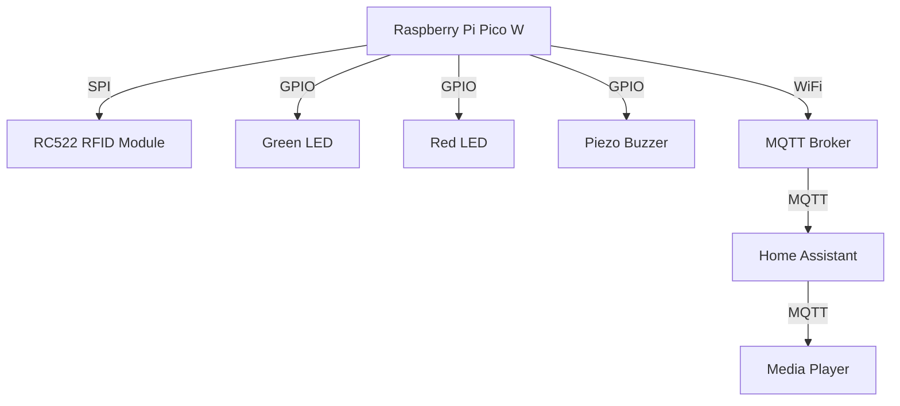

# RFID Access Control with Raspberry Pi Pico W

This project uses a Raspberry Pi Pico W, an RC522 RFID module, LEDs, and a piezo buzzer to create an access control system. When a known RFID tag is scanned, a green LED lights up and a 1-second beep is emitted from the buzzer. When an unknown tag is scanned, a red LED lights up and 3 short beeps are emitted from the buzzer. Additionally, when a known tag is scanned, a text-to-speech message is sent to a Home Assistant media player.

## Components

- Raspberry Pi Pico W
- RC522 RFID module
- Green LED
- Red LED
- Piezo buzzer
- Resistors (appropriate values for LEDs)
- Jumper wires
- Breadboard

## Wiring

- **RC522 RFID module:**
  - SCK to GP2
  - MOSI to GP3
  - MISO to GP4
  - SDA (CS) to GP5
  - RST to GP6
- **Green LED:**
  - Anode to GP15 (with resistor)
  - Cathode to GND
- **Red LED:**
  - Anode to GP14 (with resistor)
  - Cathode to GND
- **Piezo buzzer:**
  - Positive to GP13
  - Negative to GND

## Software Setup

1. Install MicroPython on your Raspberry Pi Pico W.
2. Install the MFRC522 library for MicroPython.
3. Upload the `main.py` and `secrets.py` files to your Pico W.

## `main.py` Overview

The `main.py` script initializes the RFID reader, LEDs, and buzzer. It maintains a list of authorized RFID tags and implements the main logic for tag detection and feedback.

### Key Functions

- `reset_leds()`: Turns off all LEDs.
- `beep_buzzer(times, delay)`: Generates a beep sound with the specified number of times and delay.
- `handle_authorized_card(card_id)`: Handles the logic for an authorized card, including lighting the green LED, beeping, and sending an MQTT message.
- `handle_unauthorized_card(card_id)`: Handles the logic for an unauthorized card, including lighting the red LED, beeping, and sending an MQTT message.

## `secrets.py` Overview

The `secrets.py` file stores sensitive information such as WiFi and MQTT credentials.

### Example `secrets.py`

```python
wifi_ssid = 'your_wifi_ssid'
wifi_password = 'your_wifi_password'
mqtt_server = 'your_mqtt_server'
mqtt_port = 1883
mqtt_client_id = 'your_mqtt_client_id'
mqtt_user = 'your_mqtt_user'
mqtt_password = 'your_mqtt_password'
```

## Home Assistant Configuration

### MQTT Sensors

Add the following configuration to your `mqtt.yaml` file in Home Assistant to set up the RC522 sensors:

```yaml
sensor:
  - name: "RC522 Authorized Card"
    state_topic: "rc522/card/authorized"
    value_template: "{{ value }}"
    json_attributes_topic: "rc522/card/authorized"
    qos: 0
    icon: mdi:card-account-details
  - name: "RC522 Unauthorized Card"
    state_topic: "rc522/card/unauthorized"
    value_template: "{{ value }}"
    json_attributes_topic: "rc522/card/unauthorized"
    qos: 0
    icon: mdi:card-alert
```

### Automation

Create an automation in Home Assistant to announce "Welkom Tim" when an authorized card is scanned:

```yaml
automation:
  - alias: "Welkom Tim"
    trigger:
      - platform: mqtt
        topic: "rc522/card/authorized"
    action:
      - service: tts.google_translate_say
        entity_id: media_player.nest_mini_cas
        data:
          message: "Welkom Tim"
          language: "nl"
```

## Mermaid Diagram



## Usage

1. Power on your Raspberry Pi Pico W.
2. The script will start and the RFID reader will be ready.
3. Scan an RFID tag:
   - If the tag is authorized, the green LED will light up, a 1-second beep will sound, and a text-to-speech message will be played.
   - If the tag is unauthorized, the red LED will light up and 3 short beeps will sound.

## Customization

- Update the `AUTHORIZED_CARDS` dictionary in `main.py` with your actual tag UIDs and names.
- Update the WiFi and MQTT credentials in `secrets.py`.

## Troubleshooting

- Ensure all connections are secure.
- Verify that the RFID module is properly powered.
- Check the console output for any error messages.

## License

This project is licensed under the MIT License.